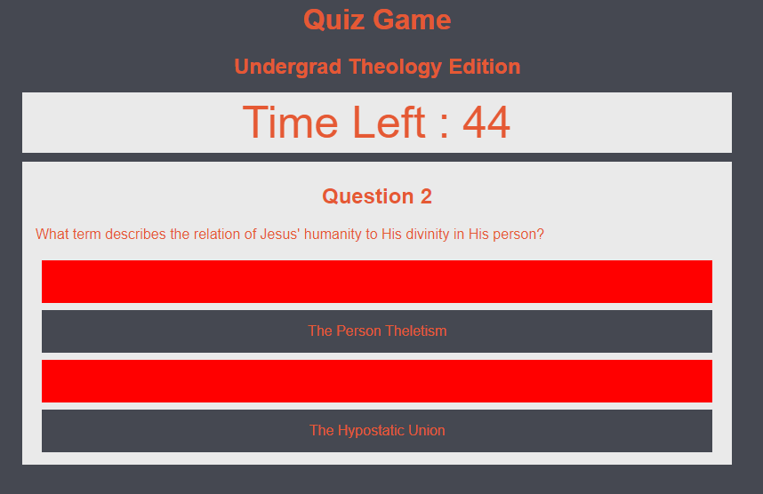
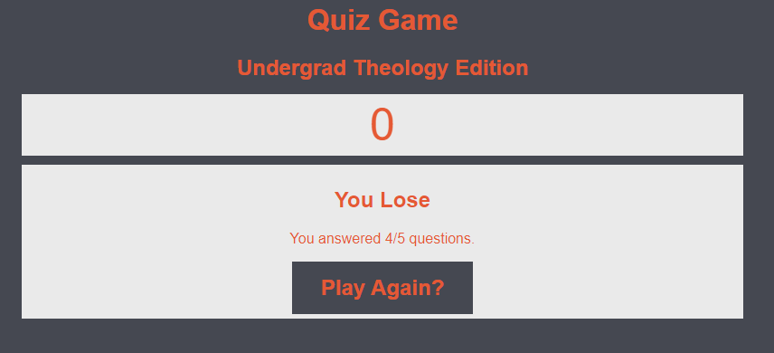

# Code Quiz
Building a Multiple Choice Quiz to exhibit Web API skills, especially Javascript

## Description

The Code Quiz was my first from scratch Web Application, utilizing HTML, CSS, and Javascript. This involved not only the creation of functions manipulating variables, but developing javascript which dynamically updated and changed HTML and CSS while locally storing variables for use by the code at a later date.

This effort emphasized, by my own decision, Javascript over HTML or CSS. Ergo, the simplicity of the UI/UX.

## Installation and Usage

Web application, hosted at: https://tomasdiaz83.github.io/CodeQuiz/

## Screenshots

The following images show the web application's appearance and functionality:

## License

Copyright 2022 Tomas Diaz

Permission is hereby granted, free of charge, to any person obtaining a copy of this software and associated documentation files (the "Software"), to deal in the Software without restriction, including without limitation the rights to use, copy, modify, merge, publish, distribute, sublicense, and/or sell copies of the Software, and to permit persons to whom the Software is furnished to do so, subject to the following conditions:

The above copyright notice and this permission notice shall be included in all copies or substantial portions of the Software.

THE SOFTWARE IS PROVIDED "AS IS", WITHOUT WARRANTY OF ANY KIND, EXPRESS OR IMPLIED, INCLUDING BUT NOT LIMITED TO THE WARRANTIES OF MERCHANTABILITY, FITNESS FOR A PARTICULAR PURPOSE AND NONINFRINGEMENT. IN NO EVENT SHALL THE AUTHORS OR COPYRIGHT HOLDERS BE LIABLE FOR ANY CLAIM, DAMAGES OR OTHER LIABILITY, WHETHER IN AN ACTION OF CONTRACT, TORT OR OTHERWISE, ARISING FROM, OUT OF OR IN CONNECTION WITH THE SOFTWARE OR THE USE OR OTHER DEALINGS IN THE SOFTWARE.